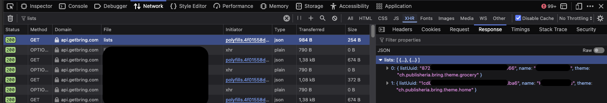

# Bring! Adapter

Connects to the Bring! API to add Items to your Bring! Shopping List

## Config

```json
{
  "services": [
    {
      ...
      "list": {
        "adapterName": "bring", // This needs to be "bring" to load this adapter
        "email": "bringUsername", // Your E-Mail with which you have registered your Account with at Bring
        "password": "bringPassword", // Your password with which you have registered your Account with at Bring
        "listId": "bringListId" // Your Bring Shopping List ID
      }
    }
  ]
}
```

### Shopping List ID

Getting your Shopping List ID is a bit tricky.

- Open [Bring Web](https://web.getbring.com) and open your browsers developer tools.
- Open the `Network`-Tab
- Login to Bring with your E-Mail and Password
- Filter for `lists`
- Copy the `listUuid` of the List you would like to use with this adapter

